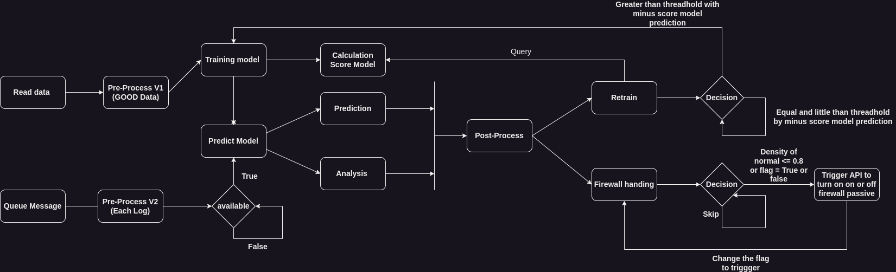
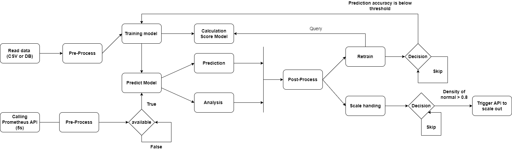

# ML_AI :coffee:

**AI and ML of NTMA in here**

	
    <strong><em>
👉 A new version of Model AI For IDS and Forecast scale is available
</em></strong>

*Model with Label using Kmean --> [File analysis](./IDS/ModelNonLabel/KMEAN.ipynb) and [Kmeans for queue message](./IDS/ModelNonLabel/IDS-Kmeans.py)*

- That module is available in used in python3 but it need env file to connect with prometheus and kafka to trigger queue messages and process analytic and predict anomalies

- Require for run this model --> Huge resource will be use on init step for model **1-2 Gb rams** (Need available) --> After that it will be stable and need resource when retrain model

- Just queue and wait to detection - Anything damage will be notify for your telegram bot

	
    <strong><em>
Design of KMeans IDS for Prediction Anomalies and Handling Firewall Passive
</em></strong>

👉 A new version of Model AI For Forecasting metrics is available

*Model Non Label using LSTM --> [File](./Forecast/training_model.py)*

- The model utilizes data retrieved from calling the Prometheus API to extract specific data. This data will be processed and stored in a file format at [here](./Data/data_metrics/2023-06-13-06.csv)!
  
- That module is available for use in Python 3, but it requires an env file to connect to Prometheus in order to access the API and collect data.
      
- Require for run this model --> Huge resource will be use on init step for model 1-2Gb Rams (Need available) --> After that it will be stable and need resource when retrain model

- After the model operates normally, when it predicts anomalies, the model will automatically enable autoscaling mode.

	
    <strong><em>
Design of Forecasting metrics and autoscaling
</em></strong>

