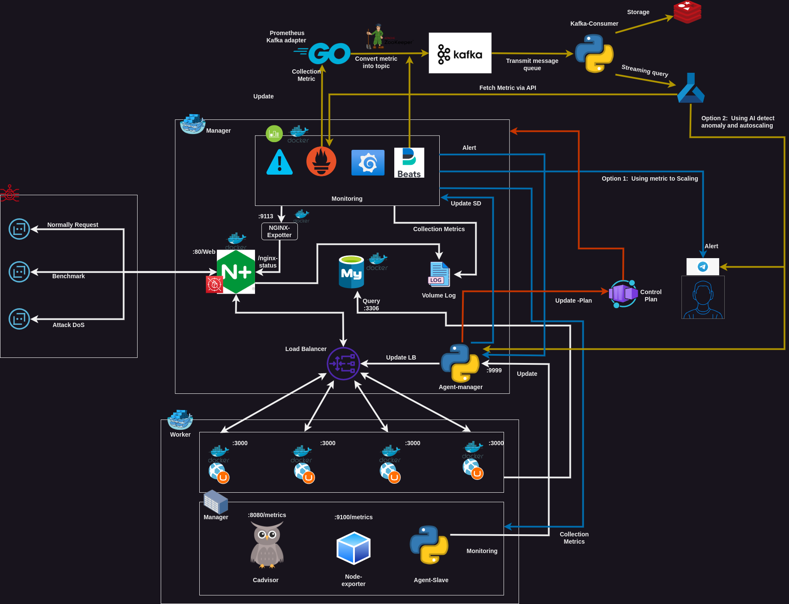

# NTMA_Anomaly

<h2><em>Network Traffic Monitor & Analysis for Anomaly Detection</em></h2>

*This repo is creature of by [@me](https://github.com/Xeus-Territory) and [@markpage2k1](https://github.com/MarkPage2k1). This is opensource, experimental and not have limited, so if you want contributed with me and mark, contact me.*

- [NTMA\_Anomaly](#ntma_anomaly)
  - [Purpose](#purpose)
  - [Project structure](#project-structure)
  - [Requirements of project](#requirements-of-project)
  - [Design Infrastructure](#design-infrastructure)

## Purpose
- Purpose of project is about make the idealy about the **HA (High Available)** system combine `DevOps` with **automation management** and `AI` for **intelligence action**.
- Follow this way, you can be **detected anomaly in network traffic** by monitoring and analysis through `log` & `metrics` for deciding to make decision **about automatic scaling by horizontal** for demand anything work with **low latency at least**
- Combine AI for anomaly detection can **make the system to becoming flexible** with data and can be **dynamically scale with flex metric** not like using basic metrics or log.
- Featured can be offer for **detection Dos/DDos, High Traffic Usage, ...**
- Malware working in system. (Develop in the future !!!)

## Project structure

- [Infrastructure](./Infrastructure/README.md): *Anything about the infrastructure contain from Cloud, docker, system-design and other component to deploy*

- [Script](./Script/README.md): *Everything about the build, setup and deployment by Bash, Python, ...*

- [ML-AI](./ML-AI/README.md): *Contain the ML and AI project inside to anomaly detection and make decisions*

- Other: *Script file for building the agent and deployment agent for orchestrating and automation system*

## Requirements of project

*2 VM or more (including cadvisor, az-cli, node-exporter, docker, ...). Don't worry, Everything i relate and even have the manual in repo*

## Design Infrastructure

	
    <strong><em>
Project Infrastructure
</em></strong>

